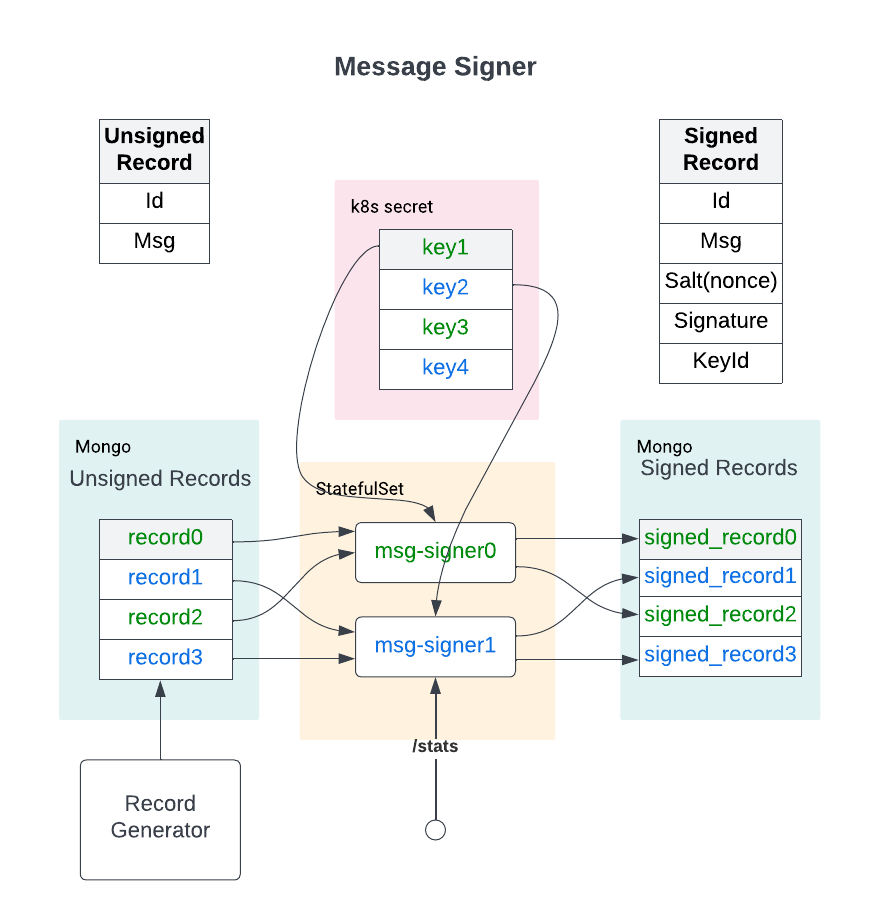

# Fast Message Signer

## Requirements

This project implements an efficient service to sign messages in bulk. 
It can be utilized for generating pre-signatures such as ones menioned in [Axelar
white paper](https://axelar.network/axelar_whitepaper.pdf). According to Axelar 
white paper, a significant work for signature computation may be done offline 
and requires no interaction between parties (non-interactive online signing). 
When actual message becomes know, only a small portion of work is remaining
in order to complete a signature. 

While the size of pre-signature parameters is not
easily found, this project assumes it will be an order of typical elliptic curve public and private key sizes,
such as 32 bytes multiplied by some factor. It uses 256 bytes of random data.

Pre-signatures will be used by validator nodes running on Axelar network, thus
such signing service must be run alongside a validator. This introduces the following
requirements:
1. It has to be resource efficient to minimize cost of running a validator
2. It has to be secure, since pre-signatures may need to use private keys
3. It has to be compact and easily deployable to reduce operational burden
4. It has to be portable and vendor-independent and should not contain proprietary modules.

The last requirement is particularly important since improves de-centralization of the network.

Additionally, each validator utilizes several public/private key pairs to perform block signing.
A pair of public/privite key pair is associated with an account on Axelar network which is funded 
to be able to submit transaction. Hence each pair in such set needs to be utilized evenly. To 
submit a new transaction, a unique nonce per account must be used. These nonces must also be sequential, 
e.g. a message with nonce N+1 cannot be processed by a network, until a message with nonce N is processed.

This project uses 100 pre-generated Ethereum keys. To simulate computation
of pre-signature it hashes message and nonce using keccak256 and uses 
a private key to sign it.

## Architecture

### Bulding blocks
To be able to satisfy these requirements, this project uses kubernetes (k8s) as containerization
platform with [helm](https://helm.sh/) for packaging. Support for these technologies provided by many vendors such as Google Cloud, Digital Ocean and 
Vulr and others. Migration between Google Cloud, Digital Ocean and Vultr only requires defining storage types specific 
for a vendor, otherwise no other changes are required.

As a data store [mongodb](https://www.mongodb.com/) is chosen. It is developer friendly data storage solution
with free community edition. It is fast, supports transactions and [packaged](https://github.com/bitnami/charts/tree/master/bitnami/mongodb) for k8s deployment.

A particular advantage of mongodb its support of transaction. Its snapshot
isolation (which relies on MVCC) fits very well with chosen architecture in this project. 
The signing is performed in parallel batches, selection of records into batches relies on consistent hashing 
approach, such that when transaction is committed, there is no conflict
between updated records, since batches never overlap.

Snapshot isolation also ensures when new records are inserted, they will not show
up in batches which already being signed and will be processed in the next transaction.

Using transaction is superior approach to using pub-sub queues or message 
brokers, since allows any number operations to be involved in a transaction.
For example when batch is signed its records are inserted into signed collection,
removed from unsigned collection and nonce of a signing key is updated to its latest value.
A failure at any point during these operations will result in a rollback to the original
state. This is very difficult to achieve using other technology.

And lastly using mondgodb reduces number of moving parts in the system. It acts like
a storage, message broker and state store.

### Wiring Diagram

The architecture of message signer is presented on a diagram below:



### Signing and shard selection

A signing is performed in batches automatically using several signing pods, which query
mongo store *unsigned record collection* for new records. During the signing, each pod
will select a signing key for a batch in its shard using round-robin approach and pulls its last used nonce from
state store maintained in mongodb. After signing is completed, the pod
1. inserts records into *signer records collection*
2. removes records from *unsigned record collection*
3. updates key nonce to the last used one
4. increments its key counter to utilize next signing key in its key shard

Record selection and signing are perfromed under context the same
transaction. It ensures that only the scanned records will be signed. All records after 
beginning of the transaction will be processed in the next signing cycle. 
Imnsertion and removal into mongodb is done using its bulk API (InsertMany, DeleteMany).

Selection of the records for each signing pods is done using consistent hashing. A 4 bytes of 
a record id are used to identify its shard as
```bigquery
shardId = recordId % totalSigners
```
Keys are also sharded similarly such that new key index 
```bigquery
keyIdx := (c.keyIdx*c.totalSigners + c.signerId) % len(c.keys)
c.keyIdx+=1
```
Note that number of keys must exceed number of signing pods. This is an obvious requirement, since otherwise, all
pods cannot be used in parallel - there would be not enough keys for them.

### Record Structures
Records before signing:
```
type Record struct {
    Id string
    Msg String
}
```

Records after signing:
```
type Record struct {
    Id string
    Msg String
    Signature string
    Salt String
    PublicKey String
}
```

### Scaling
Signing pods are deployed as StatefulSet. This allows maintaining identity of each pod
to ensure selection of record and key shards. However StatefulSet doesn't
allow dynamic scaling depending on the load. This limitation can easily
mitigated by allocating enough signing pods in advance and deploying them
on a limited number of VM nodes with auto scaling. Whenever the load increases, 
the number of VMs in node pool will be automatically increased as well
and signing pods will be re-distributed on a new nodes.

### Support for FIFO Messages
Record generator in this project creates messages with random ids, which is used for signing shard selection.
However, the message signer also works for 
messages with defined FIFO order. For example if messages are ordered by 
their nanoseconds timestamp, then while batch signing may happen out of the order, the
final stream of messages sorted by their nanosecond timestamp will  gurantee 
then consecutive order of the nonces for each signing key.

### APIs

Signing service exposes the following API

```
GET    /                # liveness         
GET    /stats           # show signed and unsigned records         
```
Note that APIs are not exposed externally via ingress, which would
require registering a domain name or getting a static IP.
For simplicity, they are available inside the cluster only 
and can be called by connection to any pod. See k8s guide for details.

### Performance
Performance of the signing was done using Google Cloud 3 node cluster.
Each node is 2 vCPU 8 GB. For the signing 256 bytes messages were used.
200k message were signed. The system was able to process these messages
under 30-40 seconds, which means that average signing speed is 5-7k messages/second.
Assuming Axelar block time of about 5 seconds this allows signing 25-35k records per block.

## Deployment

Signing service is packaged and deployed and k8s app. This 
creates a portable, vendor-independent implementation which can
be hosted on any provider with k8s support such as GCP, DigitalOcean, Vult and others

Signing keys are pre-generated and packaged as k8s secret object.

Sample record:
```
  {
    _id: ObjectId("62ee2e75d199969df1d5db58"),
    id: '830f559b22b74bfcbb5631fae20462cb',
    key: '0x04e8d44631471324a13c37e029301913c76f6eeb3277d5892a0ef58715b39c3d203d2c60f842442890e8ffaacfa4acc3eb061bab813a6f56ba629691d996a09de0',
    msg: '830f559b22b74bfcbb5631fae20462cb',
    salt: 'b001ebc1-f2f7-44de-b5ff-1da0b16af05b',
    sign: '0xa989699af09ef6cdfcec182b1043c5acd5b565a5444ea0cecb8dfbd0509695ac3d9905b32246774d46af617d122cdcea3a273a71287082feffaa4c3b9fccd82f01'
  }
```

## [Development Guide](DEVELOP.md)

## [K8s Deployment Guide](K8S.md)


